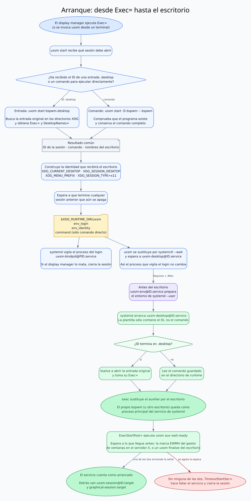
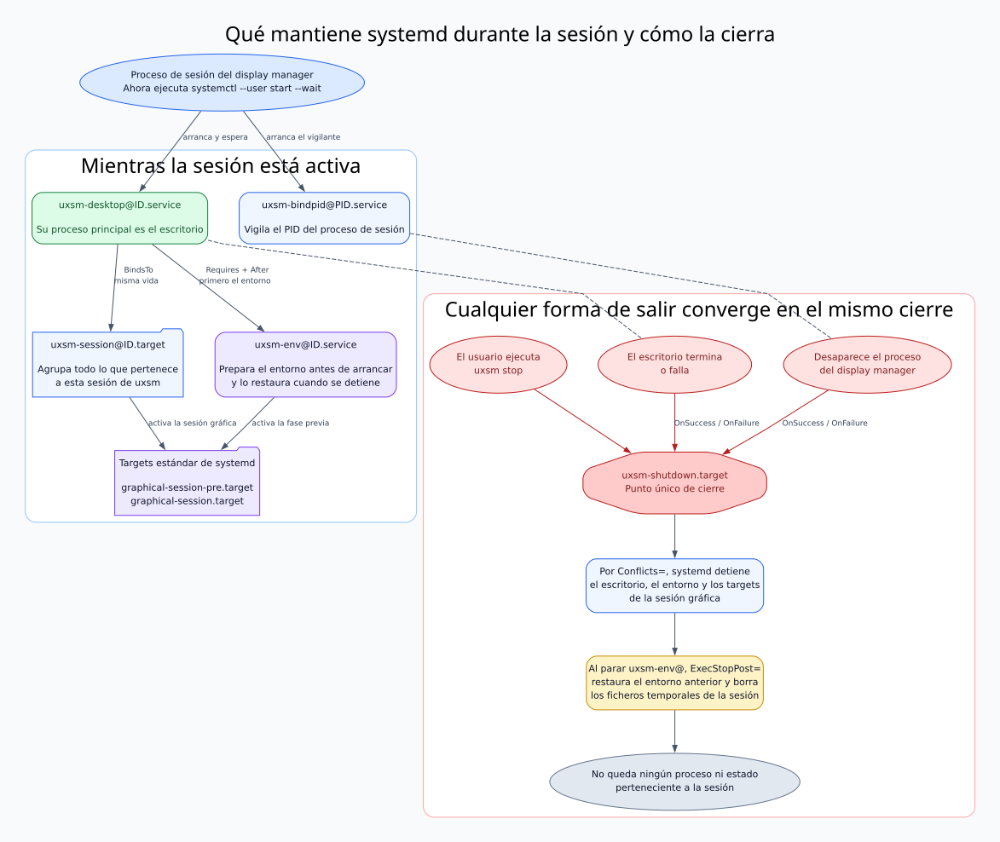
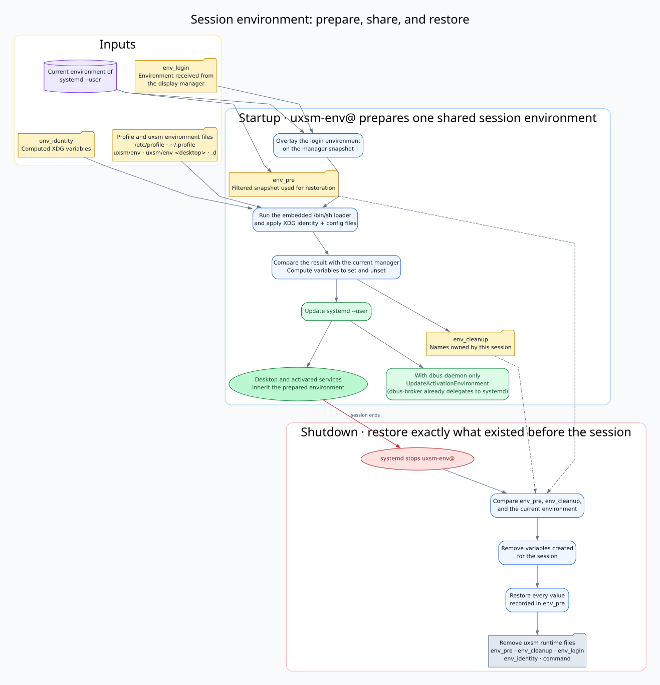
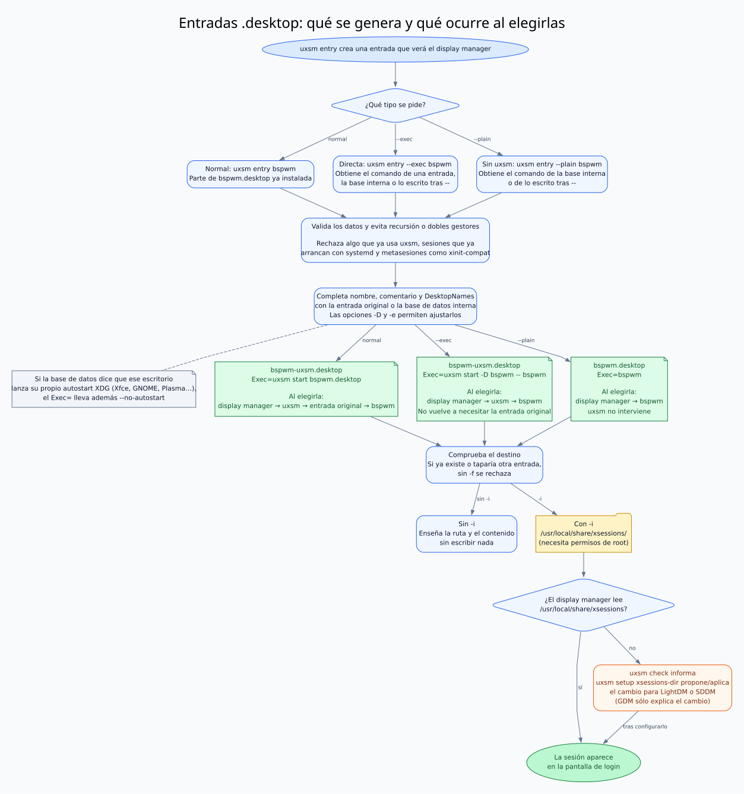
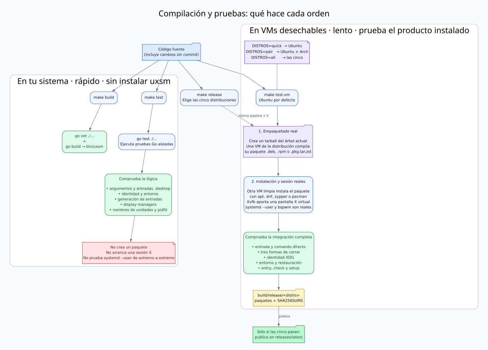

# Cómo funciona uxsm

uxsm convierte una sesión X11 en un conjunto de unidades de `systemd --user`. El escritorio deja de ser un hijo opaco del display manager: pasa a ser el proceso principal de un servicio, comparte un entorno de sesión preparado de forma explícita y arrastra targets estándar de sesión gráfica. Cuando termina el escritorio o desaparece el proceso que abrió la sesión, systemd detiene el conjunto completo y uxsm restaura el entorno anterior.

Este documento explica el comportamiento observable y señala el código que lo implementa. Los diagramas muestran un recorrido representativo; no enumeran cada error ni cada combinación de opciones. Sus fuentes DOT están junto a los SVG en `docs/flows`.

## Inicio de una sesión

`uxsm start` admite dos fuentes:

```sh
uxsm start bspwm.desktop       # lee Exec= y DesktopNames= de la entrada
uxsm start -D bspwm -- bspwm   # recibe el comando directamente
```

Un único argumento terminado en `.desktop`, sin `--`, se interpreta como un ID de entrada. Se busca en `xsessions` dentro de los directorios de datos XDG; la primera coincidencia gana. Cualquier otra forma es un comando, y su ejecutable tiene que existir en `PATH`.

En ambos casos uxsm:

1. decide el ID de la instancia (`bspwm.desktop` para una entrada, `bspwm` para el comando);
2. calcula la identidad XDG de la sesión;
3. espera a que una sesión anterior haya terminado también su limpieza;
4. guarda el entorno de login, la identidad y, si procede, el comando en `$XDG_RUNTIME_DIR/uxsm`;
5. arranca una unidad que vigila el PID entregado al display manager;
6. se sustituye por `systemctl --user start --wait uxsm-desktop@ID.service`.



[Fuente DOT](flows/session-start.dot) · Código principal: [`cmd/uxsm/start.go`](../cmd/uxsm/start.go), [`cmd/uxsm/aux.go`](../cmd/uxsm/aux.go) y `internal/desktopentry`.

La plantilla del servicio no contiene el comando del escritorio. Ejecuta `uxsm aux exec %i`:

- con un ID terminado en `.desktop`, vuelve a leer el `Exec=` de la entrada;
- con un comando directo, lee el vector de argumentos guardado por `uxsm start`.

En el último paso `aux exec` usa `exec(2)`. El proceso principal del servicio pasa a ser el propio escritorio, de modo que systemd detecta su salida sin procesos intermediarios.

### Identidad

Sin `-e`, los nombres se combinan en este orden:

1. `XDG_CURRENT_DESKTOP` recibido del display manager;
2. `DesktopNames=` de la entrada;
3. los nombres de `-D`.

Se quitan duplicados. Si no queda ninguno, se usa como último recurso el nombre del ejecutable. Con `-e` se ignoran las fuentes anteriores y `-D` pasa a ser obligatorio.

Del resultado salen `XDG_CURRENT_DESKTOP`, `XDG_SESSION_DESKTOP`, `XDG_MENU_PREFIX` y `XDG_SESSION_TYPE=x11`. La implementación está en `internal/session`.

## Grafo de unidades y ciclo de vida



[Fuente DOT](flows/systemd-lifecycle.dot) · Plantillas instaladas: `data/systemd/user`.

| Unidad | Responsabilidad |
| --- | --- |
| `uxsm-bindpid@PID.service` | Espera con `pidfd` al proceso que abrió la sesión. |
| `uxsm-env@ID.service` | Prepara el entorno antes del escritorio y lo restaura al parar. |
| `uxsm-desktop@ID.service` | Ejecuta el escritorio como proceso principal y espera a su gestor de ventanas. |
| `uxsm-session@ID.target` | Representa la sesión uxsm y arrastra `graphical-session.target`. |
| `uxsm-autostart@ID.target` | Arrastra `xdg-desktop-autostart.target` cuando el autostart le toca a uxsm. |
| `uxsm-shutdown.target` | Entra en conflicto con las unidades activas y coordina su cierre. |

La sesión se cierra por el mismo camino si:

- termina o falla el escritorio;
- el display manager mata el proceso que estaba esperando la sesión;
- alguien ejecuta `uxsm stop`.

Los dos primeros casos activan `uxsm-shutdown.target` mediante `OnSuccess=` y `OnFailure=`. `uxsm stop` activa ese target directamente. Sus conflictos paran el escritorio, los targets gráficos y el servicio de entorno; el `ExecStopPost=` de este último siempre intenta restaurar el estado previo.

### Cuándo la sesión está lista

El escritorio no cuenta como arrancado en cuanto empieza a ejecutarse. `uxsm-desktop@ID.service` lleva un `ExecStartPost=` que ejecuta `uxsm aux wait-wm`, y systemd no da el servicio por arrancado hasta que esa orden termina. Como los targets de la sesión van detrás del servicio, `uxsm-session@ID.target` y `graphical-session.target` esperan con él, y lo que arranque con la sesión gráfica encuentra un escritorio donde colocarse.

La espera es la comprobación de EWMH: la ventana raíz tiene `_NET_SUPPORTING_WM_CHECK` apuntando a una ventana del gestor de ventanas, y esa ventana tiene la misma propiedad apuntando a sí misma. Lo segundo distingue al gestor que está gobernando la pantalla de la marca que deja uno que murió de golpe. uxsm se lo pregunta al servidor X hablando el protocolo X11 desde `internal/x11`, sin libX11 ni `xprop`: es el saludo inicial y dos propiedades, y así la sesión no depende en tiempo de ejecución de ningún paquete de Xorg.

Si no llega a haber gestor de ventanas, `TimeoutStartSec=60` corta la espera: el servicio falla, su `OnFailure=` apaga la sesión y el display manager vuelve a la pantalla de inicio. Una sesión que no es un escritorio ―un solo programa X11, por ejemplo― puede quitar la espera con un fichero de anulación de la unidad:

```ini
# ~/.config/systemd/user/uxsm-desktop@.service.d/no-wait-wm.conf
[Service]
ExecStartPost=
```

### Autostart XDG

Detrás de la espera al gestor de ventanas, el segundo `ExecStartPost=` del escritorio arranca `uxsm-autostart@ID.target`, que arrastra `xdg-desktop-autostart.target`. A partir de ahí el trabajo es de systemd: `systemd-xdg-autostart-generator` crea una `app-<nombre>@autostart.service` por cada entrada de autostart y las filtra por `OnlyShowIn=` y `NotShowIn=` con el `XDG_CURRENT_DESKTOP` del gestor. Las entradas arrancan, por tanto, con el escritorio ya en pantalla, y se paran con `graphical-session.target`.

uxsm no lo activa siempre. Un escritorio con gestor de sesión lanza sus entradas de autostart él mismo, y ni él ni systemd comprueban si el otro ya las ha lanzado: en Xfce, cada entrada arranca dos veces. Así que `uxsm start` lo decide a partir de los nombres del escritorio y la tabla de escritorios conocidos:

- todos los nombres son de gestores de ventanas sueltos, como `bspwm`: uxsm activa el autostart, porque si no lo lanza él no lo lanza nadie;
- algún nombre es de un escritorio con gestor de sesión, como `XFCE`: no lo activa;
- algún nombre no está en la tabla: tampoco lo activa, porque no puede saber si ese escritorio lanza el suyo.

La decisión se escribe en `$XDG_RUNTIME_DIR/uxsm/autostart`, y quien la mira es `uxsm aux autostart`: con la marca arranca el target, y sin ella no hace nada. Los dos rodeos tienen motivo. La decisión no puede ir en un `Condition*=` de la unidad, porque las dependencias de una unidad se resuelven al montar el trabajo, antes de comprobar sus condiciones: el autostart arrancaría igual en las sesiones en las que la unidad se salta. Y el target estándar no se puede arrancar directamente, porque lleva `RefuseManualStart=`; tiene que arrastrarlo una unidad propia. El motivo va además a la salida de `uxsm start`, es decir al diario de la sesión. `uxsm start -a yes` y `-a no` deciden en lugar de la tabla.

## Entorno de la sesión

Los servicios de usuario heredan el entorno de `systemd --user`, no el del proceso que los arranca. Por eso `uxsm start` no puede limitarse a llamar a systemd: primero conserva lo que recibió del display manager y `uxsm-env@.service` lo monta en el gestor.



[Fuente DOT](flows/environment.dot) · Implementación: `internal/sessionenv`.

Durante la preparación:

1. se guarda en `env_pre` una foto filtrada del entorno de `systemd --user`;
2. el entorno de login se superpone a esa foto;
3. un cargador `/bin/sh`, empotrado en el binario, carga `/etc/profile`, `~/.profile`, la identidad y los ficheros de entorno de uxsm;
4. se calcula qué variables poner y quitar, y se guarda en `env_cleanup` qué pertenece a la sesión;
5. se actualiza el entorno de systemd y, si el bus usa `dbus-daemon`, también el de activación de D-Bus. Con `dbus-broker`, la activación ya se delega en systemd.

Los ficheros de uxsm se cargan de menor a mayor prioridad recorriendo `XDG_DATA_DIRS`, `XDG_CONFIG_DIRS` y `XDG_CONFIG_HOME`. En cada directorio se carga primero `uxsm/env`, después `uxsm/env-<escritorio>` por cada nombre de `XDG_CURRENT_DESKTOP`, y después de cada fichero su directorio `.d` en orden alfabético. Se ignoran copias y ejemplos como `*.bak`, `*.disabled` o `*.sample`.

Al cerrar, uxsm borra las variables creadas para la sesión, restaura todos los valores de `env_pre` y elimina los ficheros de trabajo. Variables de agentes SSH se conservan expresamente.

## Entradas de sesión y display managers

`uxsm entry` crea tres tipos de entrada:

```sh
uxsm entry bspwm                    # bspwm-uxsm.desktop → bspwm.desktop
uxsm entry --exec bspwm             # bspwm-uxsm.desktop → comando bspwm
uxsm entry --plain bspwm            # bspwm.desktop sin uxsm
uxsm entry --exec -- mywm --flag    # variante uxsm para un comando explícito
```



[Fuente DOT](flows/session-entries.dot) · Implementación: [`cmd/uxsm/entry.go`](../cmd/uxsm/entry.go) e `internal/sessionentry`.

Una fuente puede ser una entrada existente, un comando o la tabla de escritorios conocidos. La tabla completa nombres, comentarios, `DesktopNames` y, cuando es portable entre distribuciones, el comando. El generador rechaza entradas que ya usan uxsm, sesiones que ya arrancan el escritorio mediante `systemd --user` y metasesiones que sólo ejecutan el script personal del usuario.

Sin `-i`, la orden es una previsualización. Con `-i` escribe en `/usr/local/share/xsessions`; hace falta ejecutarla con permisos de root. No sobrescribe ni oculta otra entrada con el mismo ID sin `-f`.

No todos los display managers leen ese directorio:

- `uxsm check` identifica el display manager activo y enseña de dónde obtiene su lista;
- `uxsm setup xsessions-dir` calcula el cambio para LightDM y SDDM, y sólo lo aplica con `-i`;
- para GDM explica el cambio necesario en `XDG_DATA_DIRS`, pero no modifica su unidad.

Este código está aislado en `internal/dm` y se prueba contra árboles de configuración falsos, sin modificar el sistema que ejecuta las pruebas unitarias.

## Compilación y pruebas



[Fuente DOT](flows/build-and-tests.dot).

La diferencia esencial es el límite de la prueba:

| Orden | Dónde se ejecuta | Qué demuestra |
| --- | --- | --- |
| `make test` | Sistema actual; uxsm no se instala | Prueba funciones aisladas. |
| `make test-vm` | VMs desechables | Prueba el paquete instalado con X11 y `systemd --user`. |

Por tanto, `make test-vm` no es simplemente la misma prueba en otra distribución. Primero construye el paquete nativo en una VM y después lo instala en otra VM limpia, donde abre y cierra sesiones de prueba completas.

El proyecto sólo usa la biblioteca estándar de Go. Los recorridos habituales son:

```sh
make build             # go vet y bin/uxsm
make test              # pruebas unitarias
make test-vm           # Ubuntu por defecto
make test-vm DISTROS=pair
make test-vm DISTROS=all
make release           # todas las distribuciones y releases/latest
```

### Pruebas unitarias

`go test ./...` comprueba piezas sin privilegios ni una sesión gráfica real:

- reparto de subórdenes y distinción entre entrada y comando;
- lectura y resolución XDG de entradas `.desktop`, incluido el entrecomillado de `Exec=`;
- identidad, ficheros de runtime y carga de los ficheros de entorno;
- cálculo de cambios y restauración del entorno;
- generación y vuelta a leer de entradas;
- configuración de LightDM, SDDM y GDM sobre un sistema de ficheros falso;
- nombres de unidades, detección del bus de sesión y espera mediante `pidfd`.

### Pruebas de integración

[`test/release.sh`](../test/release.sh) crea un tarball del árbol actual, también con cambios aún no commiteados, y usa [`test/vm.sh`](../test/vm.sh) para trabajar en máquinas QEMU desechables. Para cada distribución se usan dos máquinas:

1. una compila el paquete nativo con la receta real de `packaging/`;
2. otra parte limpia, instala ese paquete con el gestor de la distribución y ejecuta las pruebas.

Las pruebas de `test/integration` usan Xvfb como servidor X y sustituyen al display manager por una unidad transitoria:

| Script | Recorrido representativo |
| --- | --- |
| `01-desktop-service.sh` | Entrada y comando directo; el escritorio queda como proceso principal. |
| `02-session-shutdown.sh` | Salida del escritorio, muerte del proceso de login y `uxsm stop`. |
| `03-session-identity.sh` | `DesktopNames`, `-D`, `-e` y variables XDG. |
| `04-session-environment.sh` | Carga de `env*` y restauración exacta por los tres cierres. |
| `05-generated-entries.sh` | Instalación, sobrescritura, `check` y `setup`. |
| `06-window-manager.sh` | Espera al gestor de ventanas y sesión que no llega a tenerlo. |
| `07-xdg-autostart.sh` | Autostart XDG: con gestor de ventanas, con escritorio y con `-a yes`. |

Las distribuciones cubiertas son Ubuntu 24.04, Debian 13, Arch, Fedora 43 y openSUSE Tumbleweed. `quick` usa Ubuntu; `pair`, Ubuntu y Arch; `all`, las cinco.

El hook `pre-commit` ejecuta `gofmt`, `go vet`, las pruebas unitarias y `sh -n` sobre los scripts. El hook `pre-push` exige que los pushes a `main`, `master` o una etiqueta `vX.Y.Z` tengan un `make release` satisfactorio del mismo commit. Se activan con `make hooks`.

## Mapa del código

| Ruta | Papel |
| --- | --- |
| `cmd/uxsm` | CLI pública y subórdenes internas llamadas por las unidades. |
| `internal/desktopentry` | Búsqueda y lectura de sesiones X11. |
| `internal/session` | Identidad y ficheros de intercambio en runtime. |
| `internal/sessionenv` | Preparación y restauración del entorno. |
| `internal/sessionentry` | Tabla conocida y generación de entradas. |
| `internal/systemd` | Operaciones contra `systemd --user` y D-Bus. |
| `internal/dm` | Detección y configuración de display managers. |
| `internal/pidwait` | Espera de procesos ajenos mediante `pidfd`. |
| `internal/x11` | Conversación con el servidor X para saber si hay gestor de ventanas. |
| `data/systemd/user` | Plantillas de unidades instaladas. |
| `test` | Integración, VMs, paquetes y recogida de sesiones de distribuciones. |
| `packaging` | Recetas de paquetes usadas por las pruebas de release. |
